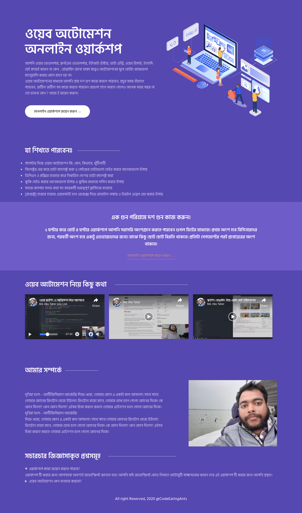

# ওয়েব অটোমেশন অনলাইন ওয়ার্কশপ

## যেভাবে প্রজেক্টটি আপনার লোকাল মেশিনে রান করবেন

এই প্রজেক্টটি আপনার লোকাল মেশিনে ব্যবহার করার জন্য প্রথমেই আপনাকে এই রিপোজিটরি টি আপনার লোকাল মেশিনে ক্লোন করে নিতে হবে। 

**পূর্বশর্ত**: অবশ্যই nodejs ইনস্টল থাকতে হবে । আর আপনি যদি [yarn](https://classic.yarnpkg.com/en/docs/install/#debian-stable) ব্যবহার করতে চান তাহলে yarn ইনস্টল করে নিবেন।  

ক্লোন করা হয়ে গেলে, এই ওয়াকিং ডিরেক্টরিতে আপনার টার্মিনাল এ ওপেন করুন।  
`yarn` অথবা `npm install ` কমান্ড দিয়ে প্রয়োজনীয় ডিপেন্ডেন্সি ইনস্টল করে নিন। 
ইনস্টল হয়ে গেলে `yarn run dev` অথবা `npm run dev`  কমান্ড দিন।  

ব্রাউজারে [http://127.0.0.1:8080/](http://127.0.0.1:8080/) লিংক টি ওপেন করুন 

সবকিছু ঠিকঠাক থাকলে আপনি ওয়েবসাইটটি দেখতে পারবেন। 

**#হ্যাপি_কোডিং :)** 

 